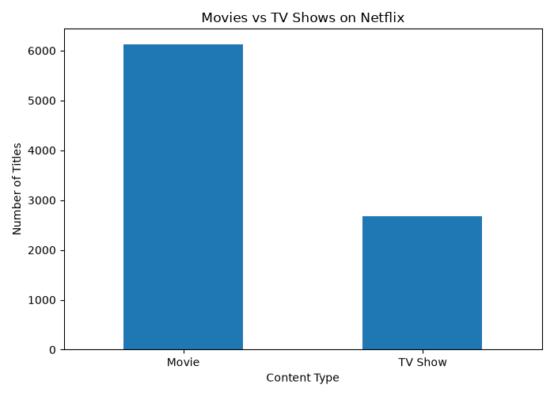
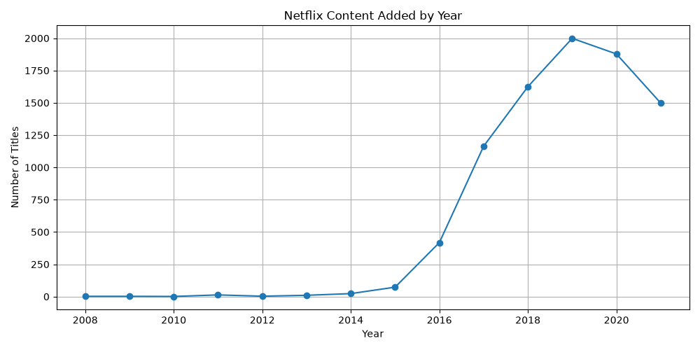
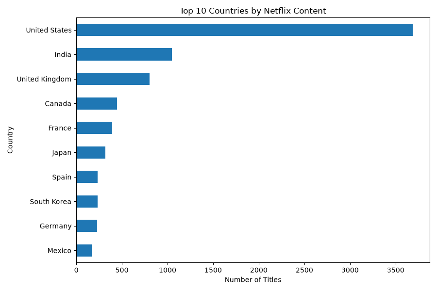
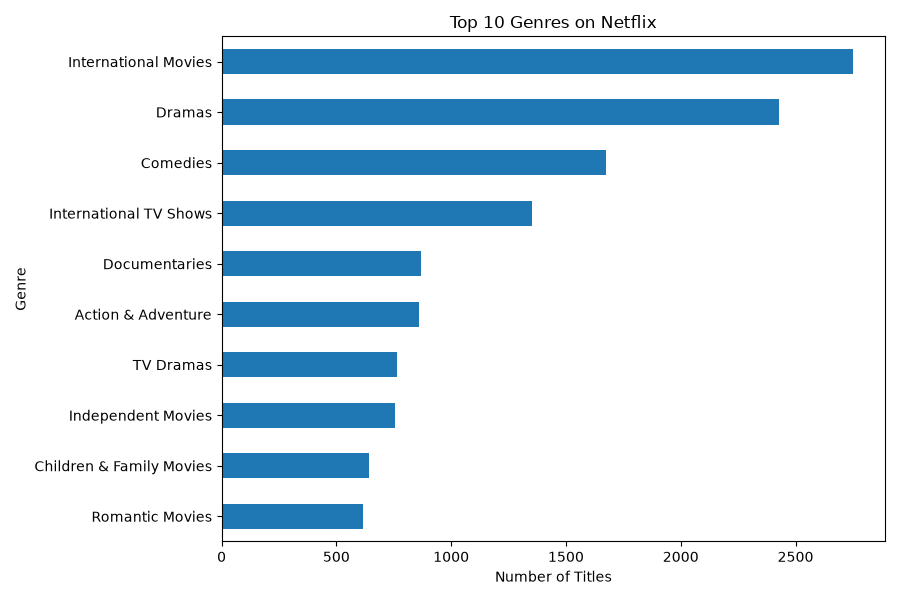
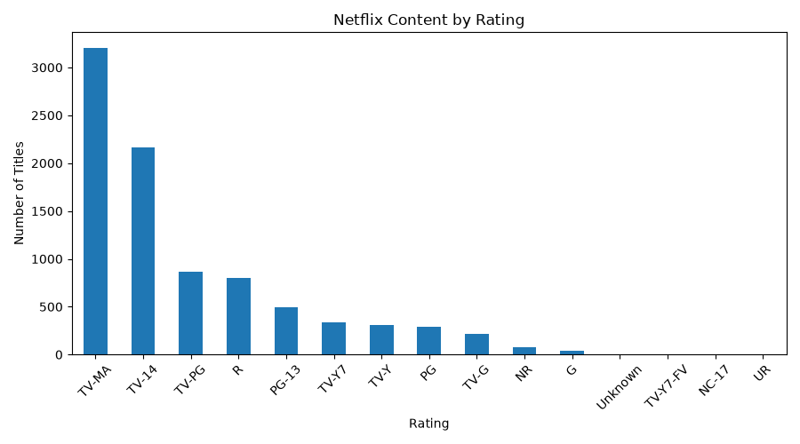
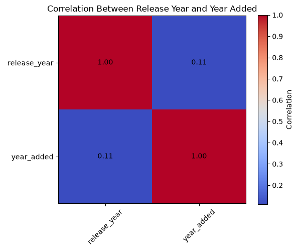

# 📊 Exploratory Data Analysis of Netflix Content

## 📌 Project Overview

This project performs Exploratory Data Analysis (EDA) on a Netflix titles dataset containing movies and TV shows.

The objective is to clean the dataset, explore patterns and trends, identify important factors, and present meaningful insights through statistical analysis and visualizations.

## 🎯 Objectives

- Clean and preprocess the Netflix dataset
- Handle missing values and duplicate records
- Analyze movies and TV shows
- Identify content trends over the years
- Analyze countries and genres
- Explore content ratings
- Study correlations between numerical variables
- Present findings through visualizations and data storytelling

## 📂 Dataset

The dataset contains **8,807 Netflix titles** and **12 original columns**.

Important columns include:

- `show_id` – Unique identifier
- `type` – Movie or TV Show
- `title` – Title of the content
- `director` – Director name
- `cast` – Cast information
- `country` – Country of production
- `date_added` – Date added to Netflix
- `release_year` – Original release year
- `rating` – Content rating
- `duration` – Movie duration or number of seasons
- `listed_in` – Genre/category
- `description` – Content description

## 🧹 Data Cleaning

The following preprocessing steps were performed:

- Checked and handled missing values
- Filled missing categorical information with appropriate values
- Processed the `date_added` column
- Extracted `year_added` and `month_added`
- Converted duration information into a numerical format
- Cleaned invalid rating values
- Checked for duplicate records

After cleaning, the dataset contained **8,807 records** with **0 duplicate rows**.

## 📊 Exploratory Data Analysis

The following analyses were performed:

### 🎬 Movies vs TV Shows

The dataset contains:

- **6,131 Movies**
- **2,676 TV Shows**

Movies make up the larger portion of the Netflix catalog.

### 📅 Content Added by Year

Content additions increased significantly over the years and reached their highest point in **2019**, with **1,999 titles** added.

### 🌎 Top Countries

The United States is the largest contributor with **3,689 titles**, followed by India and the United Kingdom.

### 🎭 Top Genres

The most common genre/category is **International Movies**, with **2,752 titles**.

### 🔞 Content Ratings

The most common rating is **TV-MA**, with **3,207 titles**.

### 🔗 Correlation Analysis

The correlation between `release_year` and `year_added` is approximately **0.11**.

This indicates a **weak positive relationship**, meaning newer content was only slightly more likely to be added to Netflix in later years.

## 📈 Visualizations

### Movies vs TV Shows



### Content Added by Year



### Top 10 Countries



### Top 10 Genres



### Content Ratings



### Correlation Heatmap



## 💡 Key Insights

- Movies are more common than TV Shows in the dataset.
- Netflix content additions increased rapidly between 2016 and 2021.
- 2019 had the highest number of content additions.
- The United States is the largest contributor of Netflix titles.
- International Movies are the most common category.
- TV-MA is the most frequent content rating.
- There are no duplicate records in the cleaned dataset.
- The relationship between release year and year added is weak, with a correlation of approximately 0.11.

## 🛠 Technologies Used

- Python
- Pandas
- Matplotlib
- Jupyter/Python environment
- GitHub

## ▶️ How to Run

1. Clone this repository.
2. Install the required Python libraries.
3. Place the dataset in the project folder.
4. Run the analysis script:

```bash
python eda_analysis.py
